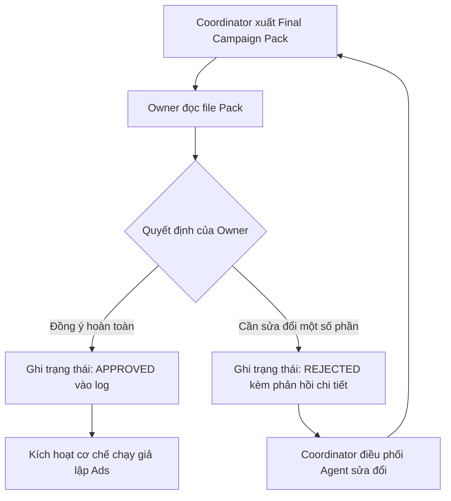

# WORKFLOW — Quy Trình Phê Duyệt Thủ Công (Human Approval Flow)

Tài liệu này hướng dẫn chi tiết cách thức Người vận hành (Human Owner) kiểm tra, đưa ra phản hồi và duyệt các gói nội dung chiến dịch do AI Agent tạo ra.

---

## 🛠️ Trình Tự Thực Hiện Phê Duyệt (Approval Steps)

### 1. Đọc Gói Chiến Dịch (Review Stage)
Human Owner truy cập vào thư mục `02_outputs/final_campaign_pack/` và mở file `final_pack_[YYYYMMDD].md` mới nhất.
Tại đây, cần kiểm tra:
- Các bài đăng Facebook/Instagram có đúng thông tin khuyến mãi không?
- Prompt thiết kế hình ảnh của Designer có mô tả đúng sản phẩm không?
- Kịch bản video của Video Editor có khả thi để quay dựng không?
- Kế hoạch phân bổ ngân sách ads của Ads Manager có hợp lý không?

### 2. Gửi Phản Hồi (Feedback Stage)
Nếu Owner muốn điều chỉnh bất kỳ nội dung nào, hãy lưu lại phản hồi chi tiết theo cấu trúc sau vào file `08_logs/agent_activity_log.md` hoặc truyền lệnh sửa đổi:
- **Đầu ra cần sửa:** [Ví dụ: Bài đăng Facebook số 2]
- **Lý do:** [Ví dụ: Thay đổi mức giảm giá từ 10% thành 15%]
- **Yêu cầu cụ thể:** [Ví dụ: Copywriter viết lại đoạn kêu gọi hành động với ưu đãi mới]

### 3. Kích Hoạt Quyết Định (Execution Stage)
- **Khi APPROVED:** Hệ thống ghi nhận trạng thái chiến dịch là hoạt động (`active`) và chuyển tiếp sang giai đoạn mô phỏng chạy quảng cáo.
- **Khi REJECTED:** Trạng thái chiến dịch ghi nhận là `needs_revision`. AI Coordinator sẽ phân tích các điểm cần sửa và gửi lại lệnh điều chỉnh cho Copywriter/Designer/Video Editor sửa lại.
- Sau khi Agent sửa đổi xong, file Final Campaign Pack mới sẽ được tạo với hậu tố phiên bản (Ví dụ: `final_pack_v2.md`) để Owner duyệt lại.
