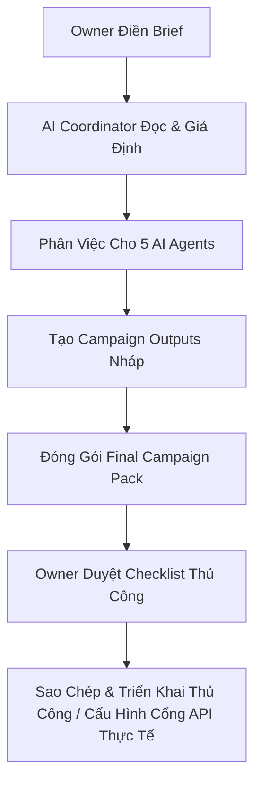

# AI Marketing Team Workspace — One Page Overview

Môi trường giả lập phòng marketing tự động được vận hành bởi AI Agent, giúp các doanh nghiệp vừa và nhỏ (SME) và các thương hiệu F&B địa phương tối ưu hóa hoạt động truyền thông.

---

## 1. Vấn đề của doanh nghiệp nhỏ (SME & Local Business)
- **Nội dung không đều đặn:** Thiếu thời gian và nhân sự chuyên trách dẫn đến các kênh mạng xã hội (Facebook, TikTok) thường xuyên bị bỏ trống.
- **Thiếu người lên ý tưởng sáng tạo:** Quanh đi quẩn lại các bài viết bán hàng nhàm chán, thiếu nội dung tương tác.
- **Nhân sự rời rạc:** Designer, Video Editor, Copywriter và Ads Manager không đồng bộ khiến chất lượng ấn phẩm không đồng nhất và chậm trễ tiến độ.
- **Chủ quán quá tải:** Phải tự tay kiểm duyệt từng câu chữ, hình ảnh từ nhiều nguồn khác nhau.
- **Quảng cáo thiếu chiến lược:** Chạy ads theo cảm tính, không phân nhóm đối tượng, không thử nghiệm nhiều góc sáng tạo.
- **Báo cáo phức tạp, khó hiểu:** Trình quản lý quảng cáo quá rối rắm, không chỉ rõ được hiệu quả thực sự và hành động cần tối ưu.
- **Không có hệ thống lưu tri thức:** Khi nhân sự nghỉ việc, toàn bộ lịch sử và phong cách thương hiệu bị thất thoát.

## 2. Giải pháp: AI Marketing Team Workspace
Hệ thống thiết lập một văn phòng Marketing giả lập với sự phối hợp nhịp nhàng của **5 vai trò AI chuyên nghiệp**:
1. **Copywriter Agent:** Sáng tạo slogan, bài đăng social chuẩn phong cách thương hiệu và lời kêu gọi hành động (CTA).
2. **Video Editor Agent:** Lên kịch bản chi tiết từng khung hình cho video ngắn dạng Reels/TikTok/Shorts.
3. **Designer Agent:** Lên bố cục thiết kế, ý tưởng hình ảnh và dịch prompt tiếng Anh vẽ ảnh AI.
4. **Ads Manager Agent:** Đề xuất góc tiếp cận, nhắm đối tượng mục tiêu và lập sơ đồ phân bổ ngân sách lý thuyết.
5. **Data Reporter Agent:** Tổng hợp số liệu quảng cáo giả lập và phân tích đề xuất tối ưu hóa.

## 3. Hệ thống làm được gì cho bạn?
- **Nhận Brief Chiến dịch nhanh chóng:** Chỉ cần điền các thông tin cơ bản về sản phẩm, giá cả và ưu đãi.
- **Tạo Lịch trình 7 ngày tự động:** Phân phối nội dung đồng đều trên các kênh.
- **Sản xuất trọn bộ ấn phẩm nháp:** Viết sẵn caption, kịch bản video chi tiết, prompt ảnh sắc nét.
- **Lập kế hoạch Ads giả định:** Định hướng tệp khách hàng tiềm năng và thông điệp tối ưu.
- **Báo cáo kết quả giả lập:** Trực quan hóa hiệu suất giúp chủ thương hiệu hiểu rõ các chỉ số tài chính cơ bản.
- **Checklist phê duyệt thủ công:** Giúp chủ quán dễ dàng rà soát tính chính xác của thông tin sản phẩm và giá cả trước khi dùng.

## 4. Điều hệ thống KHÔNG tự làm trong bản demo (Safety Rules)
Để đảm bảo an toàn tuyệt đối cho doanh nghiệp:
- **Không tự động đăng bài:** AI không tự ý xuất bản bài viết lên Fanpage.
- **Không tự động nhắn tin:** Không tự gửi tin nhắn hay tương tác với khách hàng thật.
- **Không tự động chạy quảng cáo/tiêu tiền:** Không tự kết nối tài khoản quảng cáo hay tiêu ngân sách thực tế.
- **Không kết nối Canva/Meta/Drive:** Mặc định các cổng kết nối là **DISCONNECTED** trừ khi có sự phê duyệt và cài đặt riêng từ Owner.

## 5. Lợi ích vượt trội
- **Tốc độ vượt trội:** Nhận ngay bộ campaign nháp 7 ngày chỉ sau vài phút thay vì cả tuần làm việc với agency truyền thống.
- **Đồng bộ hóa 100%:** Ý tưởng bài đăng, kịch bản video và hình ảnh đồng nhất về thông điệp và tone giọng.
- **Duyệt bài dễ dàng:** Tất cả được đóng gói trong một tài liệu duy nhất có checklist đi kèm để duyệt nhanh.
- **Giảm phụ thuộc nhân sự:** Giảm tải áp lực cho chủ quán, dễ dàng dùng làm tư liệu training nhân viên content nội bộ.
- **Dễ dàng mở rộng:** Nền tảng tuyệt vời để các Agency Marketing local scale quy trình làm việc với khách hàng.

## 6. Demo Flow 7 ngày

## 7. Phù hợp nhất với các ngành hàng
- **F&B:** Quán ăn, nhà hàng, tiệm trà sữa, tiệm cafe local.
- **Dịch vụ làm đẹp:** Spa, salon tóc, tiệm nails.
- **Chăm sóc sức khỏe:** Phòng khám nha khoa, phòng tập gym/yoga.
- **Bán lẻ:** Cửa hàng thời trang, mỹ phẩm, cửa hàng quà tặng.

## 8. Lời kêu gọi hành động (CTA)
> [!TIP]
> **Trải nghiệm ngay lập tức!**
> Chỉ cần cung cấp thông tin Brief thương hiệu sơ bộ (tên quán, sản phẩm chính, ưu đãi chiến dịch và mục tiêu), hệ thống AI của chúng tôi sẽ tự động thiết lập và sản xuất bản chiến dịch Demo 7 ngày hoàn chỉnh để bạn kiểm duyệt và đánh giá hiệu quả.
