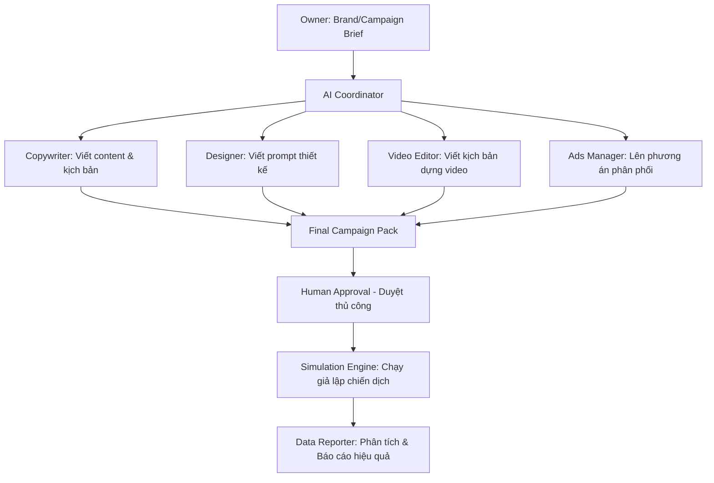

# PROJECT BLUEPRINT — Bản Thiết Kế Dự Án AI Marketing Team

Tài liệu này xác định kiến trúc tổng thể, quy trình vận hành và kế hoạch phát triển của **AI Marketing Team Workspace**.

## 1. Mục tiêu dự án
Xây dựng một hệ sinh thái mô phỏng hoạt động Marketing khép kín. Nơi các AI Agent có khả năng phối hợp nhịp nhàng, tối ưu hóa nội dung, lên kế hoạch truyền thông và báo cáo dữ liệu giả lập cho các doanh nghiệp local, độc lập hoàn toàn với các nền tảng thực tế.

## 2. Mô hình 5 Vai trò AI (5 AI Roles)
Hệ thống vận hành xoay quanh 5 AI Agent chuyên biệt:
1. **Copywriter (Trình viết nội dung):** Chịu trách nhiệm sáng tạo bài đăng mạng xã hội, kịch bản video ngắn và các bài viết quảng cáo.
2. **Video Editor (Biên tập Video):** Lên kịch bản chi tiết, storyboard, mô tả hiệu ứng chuyển cảnh và âm thanh cho các video ngắn.
3. **Designer (Thiết kế Visual):** Tạo mô tả hình ảnh nghệ thuật, phối cảnh, màu sắc và viết prompt chi tiết cho AI tạo ảnh (như Fal.ai / Midjourney).
4. **Ads Manager (Quản lý Quảng cáo):** Lên kế hoạch phân bổ ngân sách giả lập, nhắm mục tiêu (targeting) và thiết kế cấu trúc nhóm quảng cáo.
5. **Data Reporter (Báo cáo Dữ liệu):** Thu thập dữ liệu chiến dịch giả lập, phân tích hiệu suất và xuất báo cáo PDF/Markdown định kỳ.

## 3. Quy trình Hoạt động Tổng thể

## 4. Input & Output Của Hệ Thống

### Đầu vào cần có (Required Inputs)
- **Brand Profile:** Thông tin cốt lõi về thương hiệu (Tên, sản phẩm chủ đạo, định vị, tone of voice, địa chỉ, kênh truyền thông).
- **Campaign Brief:** Mục tiêu chiến dịch (Tăng nhận diện, đẩy số sản phẩm mới), ngân sách giả lập, thời gian chạy và thông điệp chính.

### Đầu ra tạo ra (Created Outputs)
- **Social Posts:** Caption hoàn chỉnh kèm hashtag và chỉ dẫn hình ảnh đi kèm.
- **Short Video Framework:** Kịch bản phân cảnh chi tiết (visual + audio).
- **Visual Design Prompts:** Danh sách prompt chuẩn tiếng Anh để đưa vào AI generator.
- **Ads Plan & Config:** File thông tin cấu hình nhóm quảng cáo và ngân sách.
- **Performance Report:** Báo cáo định kỳ bằng số liệu tương tác giả lập (Reach, Click, CTR, Conversion Rate).

## 5. Roadmap Phát triển (Từ Demo đến Workspace hoàn chỉnh)

### Phase A — Workspace Foundation (Hiện tại)
- Thiết lập cấu trúc thư mục tiêu chuẩn.
- Định nghĩa rõ ràng kỹ năng (Skills), vai trò (Agents) và luồng hoạt động (Workflows).
- Xây dựng tài liệu hướng dẫn và ranh giới an toàn.
- Hoàn thiện bộ Demo cho local business.

### Phase B — Local Simulation Scripts
- Viết các file script python/JS giả lập để tự động hóa luồng chuyển dữ liệu giữa các Agent.
- Tự động gọi API tạo ảnh (như Fal.ai/Replicate) để lưu ảnh demo vào thư mục thiết kế.
- Viết script tạo dữ liệu báo cáo giả lập ngẫu nhiên dưới dạng file CSV/JSON và tự động render báo cáo Markdown.

### Phase C — Connectors & Human-in-the-loop (Tương lai)
- Tích hợp công cụ quản lý tác vụ (như n8n hoặc Trello) để quản lý luồng phê duyệt từ Owner.
- Tích hợp cổng Telegram approval gửi bài viết/ảnh cho Owner ấn nút "Duyệt/Sửa".
- Kết nối Drive/Sheets API thực để lưu file báo cáo và bài đăng đã duyệt.
- Tích hợp các công cụ hỗ trợ đăng bài (mô phỏng hoặc qua API Sandbox).
