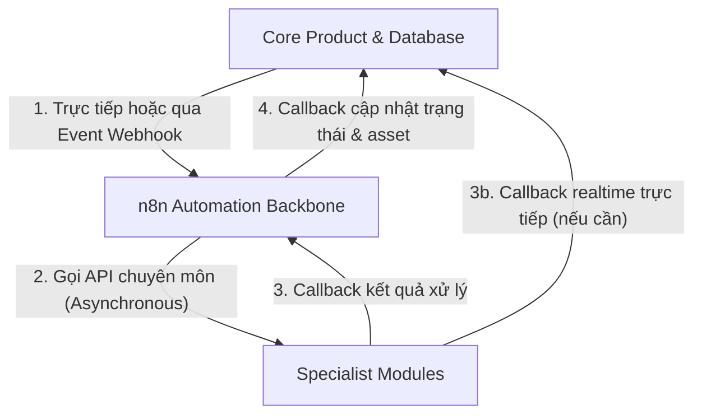

# The Core Agency - PC2 Workstream (n8n & Modules)

This document establishes the architectural foundations and development policies for the PC2 (Automation & Specialist Modules) workstream of The Core Agency project.

## 1. Bối cảnh & Vai trò của PC2
- **PC1 (Core Product/UI/Auth/Database)**: Phụ trách toàn bộ phần lõi của ứng dụng (Frontend, Backend, Database schema, Authentication, Production configuration).
- **PC2 (n8n & Modules Workstream)**: Chỉ phụ trách việc tích hợp luồng tự động hóa (n8n), các Module chuyên môn xử lý tác vụ nền (Background Specialist Services), và định nghĩa các contract giao tiếp (Schemas).
- **Nguyên tắc cốt lõi**:
  - PC2 **không** xây dựng giao diện người dùng chính (Core UI).
  - PC2 **không** trực tiếp chỉnh sửa Core Product, Auth, Database hoặc Production config.
  - Mọi thành phần do PC2 phát triển đều được thiết kế để phục vụ và hỗ trợ Core Product.

## 2. Kiến trúc bắt buộc
Kiến trúc hệ thống của The Core Agency tuân thủ mô hình phân lớp rõ ràng:
1. **Core (PC1)**: Đóng vai trò quản lý, phê duyệt (Human-in-the-loop) và lưu giữ trạng thái hệ thống. Core database là **Source of Truth** duy nhất của toàn bộ hệ thống.
2. **n8n (PC2)**: Đóng vai trò là **Automation Backbone** (xương sống điều phối). n8n chịu trách nhiệm định tuyến các event từ Core đến các module chuyên môn và báo cáo kết quả ngược lại.
3. **Modules (PC2)**: Đóng vai trò là các **Specialist Services** (dịch vụ chuyên môn như ComfyUI, Canva, Meta Ads, etc.). Modules nhận dữ liệu yêu cầu, thực thi công việc và trả về kết quả qua webhook.
4. **Webhook Callback (PC2 & PC1)**: Luồng giao tiếp bất đồng bộ bắt buộc để đồng bộ trạng thái từ Modules/n8n về Core Database.
5. **UI (PC1)**: Chỉ hiển thị dữ liệu đã được lưu trữ và phê duyệt tại Core Database.

## 3. Quy trình tích hợp
1. **Core → n8n → Modules**: Khi một hành động được tạo ra hoặc kích hoạt trên Core, một event sẽ được gửi tới n8n event router. n8n kiểm tra và phân phối đến Module thích hợp.
2. **Core → Module API**: Sử dụng cho các trường hợp cần tương tác thời gian thực (realtime) trực tiếp giữa Core và API của Module (ví dụ: truy vấn trạng thái tức thời).
3. **Module/n8n → Core Webhook**: Đây là kênh bắt buộc để trả kết quả xử lý. Bất kỳ Module nào sau khi hoàn thành nhiệm vụ đều phải gọi callback webhook về Core để cập nhật trạng thái dữ liệu.

## 4. Quy tắc an toàn bắt buộc (Safety Rules)
- **Không tự động hành động ngoài đời thực (No Auto Real-world Actions)**: Không được phép tự động xuất bản (no auto-post), tự động tiêu ngân sách quảng cáo (no auto-ads spending), hoặc tự động gửi tin nhắn cho khách hàng thật (no auto-messaging real customers) nếu chưa có trạng thái phê duyệt cuối cùng (`final_approval_granted = true`) từ Core.
- **Không bypass Approval**: Mọi tác vụ có tính chất tác động thực tế (Ads, Posting, Messaging) bắt buộc phải có sự xác nhận của người dùng tại Core UI trước khi thực thi.
- **Không Hardcode thông tin nhạy cảm**: Không đưa API key, Token, Password thật vào mã nguồn hoặc workflow JSON. Sử dụng biến môi trường thông qua file cấu hình `.env.example` làm tài liệu hướng dẫn cấu hình.
- **ComfyUI là Specialist Module**: ComfyUI đóng vai trò là một module tạo ảnh/video chạy ngầm, không được coi là một phần của Core UI. Mọi asset sinh ra từ ComfyUI phải được cập nhật ngược về Core Database để hiển thị trên Core UI.
