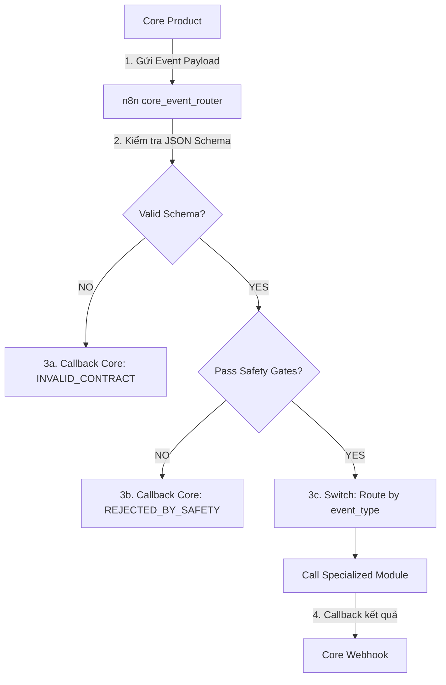

# Contract Validation Strategy

This document describes the design principles, validation flow, and error handling strategy for communications between the Core Product and the PC2 automation layer (n8n & specialized modules).

## 1. Tổng quan chiến lược (Overview)
Trong hệ thống của The Core Agency, toàn bộ dữ liệu nghiệp vụ và trạng thái phê duyệt đều được lưu trữ tập trung tại **Core Database (Source of Truth)**. Nhóm PC2 (n8n & Modules) hoạt động hoàn toàn ở dạng **Stateless** (không lưu giữ trạng thái lâu dài) và giao tiếp bất đồng bộ qua Webhook/API.

Để đảm bảo tính nhất quán dữ liệu và ngăn chặn các lỗi runtime, mọi thông điệp trao đổi giữa Core và n8n phải được xác thực nghiêm ngặt dựa trên các JSON Schema đã cam kết (Contracts).

## 2. Luồng xử lý và Xác thực (Validation Flow)
Quy trình xử lý một sự kiện từ Core gửi sang n8n diễn ra qua các bước sau:

### Bước 2.1: Xác thực cấu trúc (Schema Validation)
- Khi n8n Event Router nhận được sự kiện từ Core, node validation đầu tiên sẽ phân tích và đối chiếu payload nhận được với `core_to_n8n_event.schema.json`.
- **Nếu Schema không hợp lệ (INVALID_CONTRACT)**:
  - n8n lập tức dừng luồng định tuyến.
  - Gửi một HTTP POST callback ngược về Core với status = `INVALID_CONTRACT` kèm thông tin chi tiết lỗi (ví dụ: thiếu `event_id`, sai định dạng `correlation_id`).

### Bước 2.2: Xác thực quy tắc an toàn (Safety Gates Check)
- **General Safety Gate (Cổng an toàn chung)**: Kiểm tra cấu trúc đối tượng `safety` (phải tồn tại và đúng định dạng đối tượng) trước khi chuyển qua bộ định tuyến.
- **Specific Safety Gates (Cổng an toàn nghiệp vụ)**: Sau khi rẽ nhánh theo `event_type`, đối với các sự kiện kích hoạt hành động ngoài đời thực (như `CAMPAIGN_PUBLISH_REQUESTED` hay `ADS_SPEND_REQUESTED`):
  - n8n kiểm tra nghiêm ngặt điều kiện phê duyệt: `approval_status == "APPROVED"`, `safety.final_approval_granted == true` và các cờ cho phép tương ứng có bằng `true`.
  - **Nếu không thỏa mãn điều kiện an toàn (REJECTED_BY_SAFETY)**:
    - n8n lập tức dừng luồng xử lý.
    - Gọi webhook callback trả kết quả về Core với status = `REJECTED_BY_SAFETY` kèm mô tả chi tiết lỗi chặn, tuyệt đối không gọi API thật của Module.

### Bước 2.3: Định tuyến và Thực thi (Routing & Execution)
- Khi cả hai bước trên đều thành công, n8n Event Router dựa trên `event_type` để chuyển yêu cầu đến Module tương ứng (ComfyUI, Facebook Publisher, Canva, etc.).
- Module chuyên môn tiếp nhận yêu cầu, xử lý và báo cáo kết quả hoàn thành hoặc thất bại trực tiếp về webhook của Core (hoặc thông qua n8n callback worker) với status tương ứng (`COMPLETED` hoặc `FAILED`).

## 3. Quy tắc cốt lõi (Core Integration Rules)
1. **Core Database là Source of Truth**: n8n và các module không tự ý thay đổi dữ liệu hoặc lưu trữ trạng thái riêng mà không cập nhật về Core.
2. **Không bypass Approval**: Không một Module nào được phép thực hiện hành động publish bài đăng thật, tiêu ngân sách ads thật, hoặc gửi tin nhắn cho khách hàng thật nếu chưa có tín hiệu duyệt rõ ràng từ Core.
3. **Traceability (Khả năng truy vết)**: Mọi log validation và callback phải luôn mang theo `correlation_id` và `job_id` ban đầu để phục vụ việc đối chiếu logs giữa Core và n8n.
